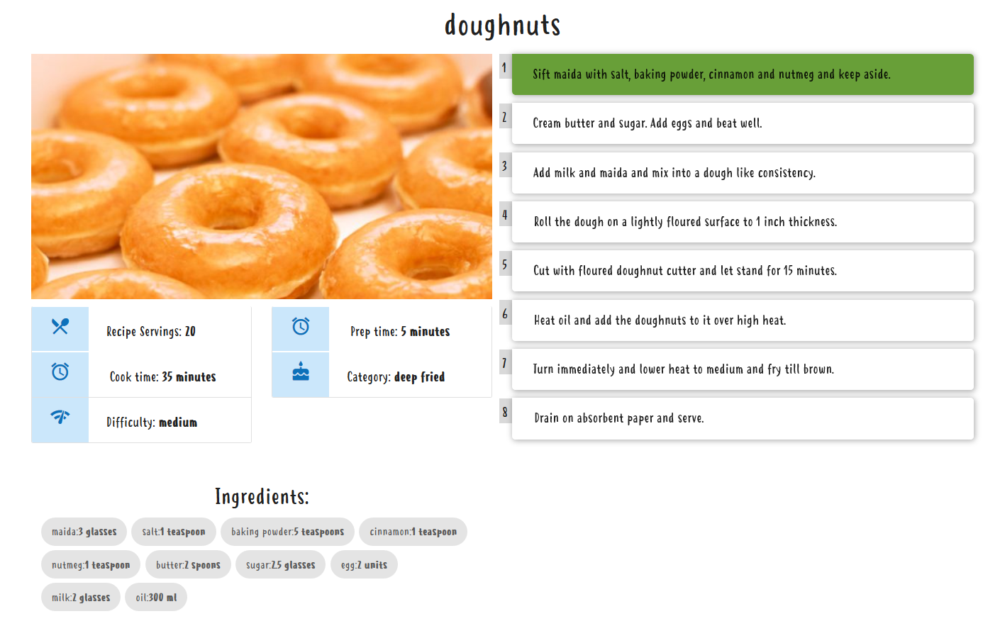
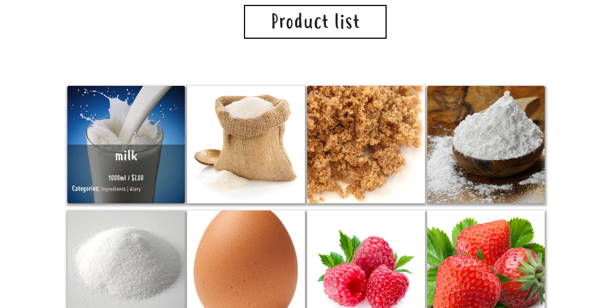
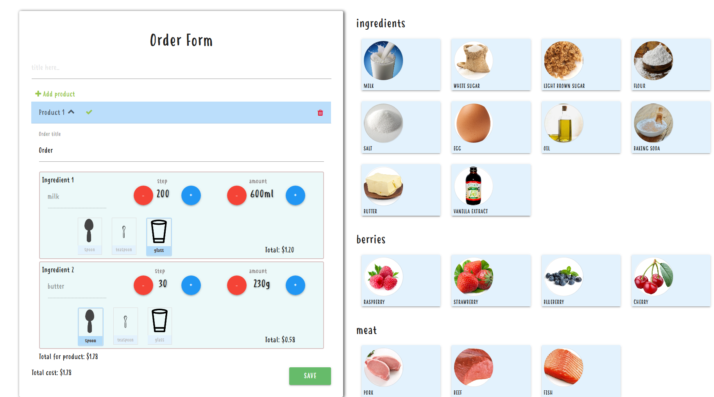

# foodCalculatorWithRecipes
calculator of the production cost for custom products
live demo here: https://dist-awdncthypb.now.sh/

Menu view:

Recipe details view where you can mark steps as DONE:

Product list with info about products:

Main form of this app implemented with reactive forms.Here you can add products,ingredients from the list as well as regulate amount of those. Form then calculates the total cost for individual ingredients,products and finally the whole order:

